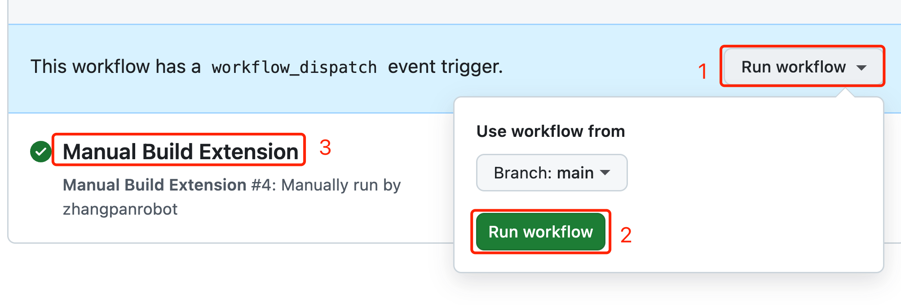
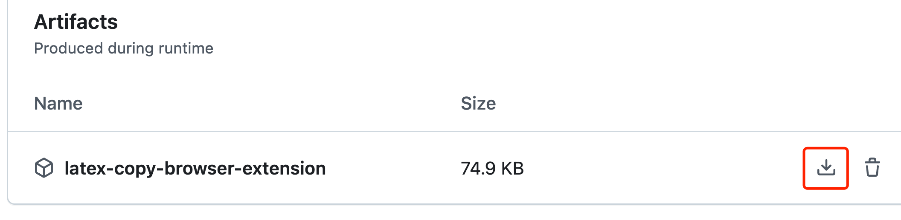

# Latex Copy Browser Extension

### How to use github to build extension (for normal user)
- [Open This](https://github.com/super-simple-solution/math-formula-helper/actions/workflows/build.yml)
- Click the right corner of the page `Run workflow`, then click the green button `Run workflow` in the pop-up box
- When the task is successfully completed, a green icon will appear in step `3`, click `3` to open result page

- Download the browser extension, then unzip it to a folder, default is `latex_copy` folder

- Drop the folder to `chrome://extensions/` for Google Chrome or `edge://extensions/` for Microsoft Edge, depending on which browser you use, please ensure that the `Developer mode` option on the page is in the open state. If not, please manually open it.

### How to run locally (for developer)
#### Requirements
- [Nodejs](https://nodejs.org/en/download) and [pnpm](https://pnpm.io/installation)
1. `pnpm i` // install dependencies
2. `pnpm build` // you need build it then drop `./dist` folder to your browser
3. `pnpm dev` // for local development only

The source code is in the `./dist` folder. 